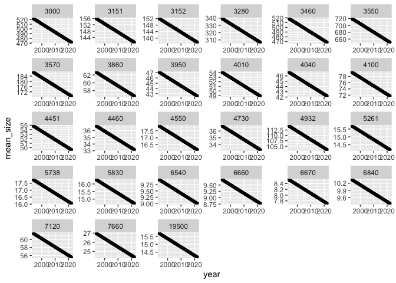
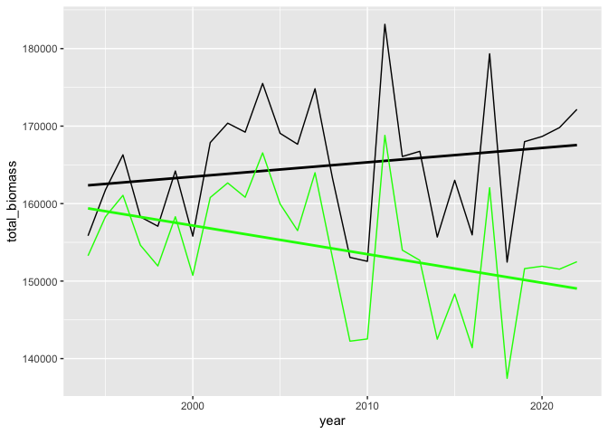
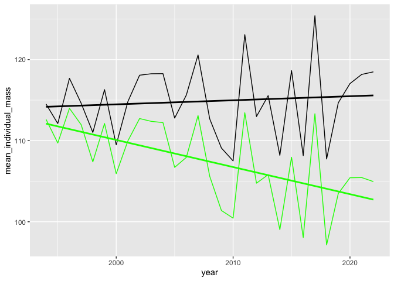

Community-wide declining body size
================

``` r
# stick mean masses to dat

dat <- dat %>% filter_bbs_survey() %>% left_join(sd_table) %>% rename(orig_aou = aou)
```

    ## Joining, by = "aou"

``` r
# create 10% shrink in body size

dat_shrinking <- dat %>%
  mutate(new_mean_size =
           mean_mass * (.9 + (.1 * ((2018 - year) / 30)))) %>%
  select(year, orig_aou, speciestotal, new_mean_size) %>%
  rename(mean_size = new_mean_size)

ggplot(dat_shrinking, aes(year, mean_size)) + 
  geom_point() +
  facet_wrap(vars(orig_aou), scales = "free")
```

<!-- -->

``` r
simdat_shrinking <- community_generate(dat_shrinking)

simdat <- community_generate(dat)
```

``` r
ts <- community_summarize(simdat, level = "year")
ts_shrinking <- community_summarize(simdat_shrinking, "year")

ggplot(ts, aes(year, total_biomass)) +
  geom_line() +
  geom_smooth(method = "lm", se = F, color = "black") +
  geom_line(data  = ts_shrinking, color = "green") +
  geom_smooth(data = ts_shrinking, method = "lm", se = F, color = "green") 
```

    ## `geom_smooth()` using formula 'y ~ x'
    ## `geom_smooth()` using formula 'y ~ x'

<!-- -->

``` r
ggplot(ts, aes(year, mean_individual_mass)) +
  geom_line() +
  geom_smooth(method = "lm", se = F, color = "black") +
  geom_line(data  = ts_shrinking, color = "green") +
  geom_smooth(data = ts_shrinking, method = "lm", se = F, color = "green") 
```

    ## `geom_smooth()` using formula 'y ~ x'
    ## `geom_smooth()` using formula 'y ~ x'

<!-- -->
